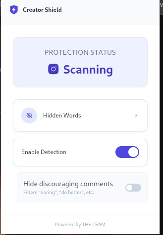

# Social Shield

Social Shield is a privacy-first browser extension and locally-hosted backend designed to make social media safer by intercepting and filtering comments in real-time. It provides tailored filtering strategies: from catching explicit profanity, to identifying passive-aggressive "soft harassment" that platforms often ignore.

Here is how the extension looks in action:


Check out our full demo video on YouTube:
[](https://www.youtube.com/watch?v=VJcQ6SRnVuQ)

## Exact Implementation: The 4-Layer Protection Cascade

We built a real-time comment moderation system that consists of two main components:
1. **JavaScript Browser Extension:** Intercepts DOM changes in real-time to analyze incoming and outgoing comments.
2. **Python / FastAPI Backend:** A dedicated local ASGI server (running 4 workers) that orchestrates low-latency decision logic and serves our local AI models.

To balance speed, accuracy, and cost, we designed a highly specific **4-Layer Protection Cascade**. Every comment goes through this exact pipeline:

1. **Stage 0 (Keyword Filter):** The frontend extension runs a local regex filter for user-chosen bad words. This runs instantly on the device before anything even hits the backend.
2. **Stage 1 (Local Guard):** The backend immediately runs the comment through a fine-tuned **`s-nlp/roberta_toxicity_classifier` (RoBERTa-Large)**. This handles immediate recognition of general hate speech and typical toxicity.
3. **Stage 2 (Cloud Fallback):** If the RoBERTa model is unsure about a severe toxicity case (confidence drops below our `0.70` threshold), the system automatically falls back to the **OpenAI Moderation API**. This is highly reliable, free-to-use omni-moderation that steps in when needed.
4. **Stage 3 (Context Engine):** For comments that pass the initial toxic filters, we run our customized **SetFit** model (`all-MiniLM-L12-v2`). This sentence transformer detects "soft harassment" and discouraging comments (passive-aggressive behavior) that traditional classifiers miss.

The architecture is entirely stateless. We do not store or sell user data; text is discarded the moment it is evaluated.

## What We Found (Benchmarks)

We validated our architecture against real-world test sets (e.g., Instagram comments) and found:
*   **Explicit Hate (Stages 1 & 2):** We caught up to **98%** of explicit hate using our fine-tuned RoBERTa-Large model combined with the OpenAI API fallback.
*   **Soft Harassment (Stage 3):** We achieved **~86% recall** on detecting subtle harassment and discouraging comments in our benchmarks using the SetFit model.

The combination of a small localized model (SetFit), a robust local classifier (RoBERTa), and a cloud fallback (OpenAI) allows us to achieve high accuracy for nuanced moderation while maintaining low inference latency.

---

## How to Launch the Extension

Follow these steps to set up and run the Social Shield environment locally:

### 1. Environment & AI Models Setup
First, prepare your Python virtual environment and download the necessary AI models:

```bash
# Create and activate virtual environment
python3 -m venv venv
source venv/bin/activate  # Windows: venv\Scripts\activate

# Install dependencies
pip install -r requirements.txt

# Download required local models
cd Gen_AI/downloading_models
python download_model.py
cd ../..
```

### 2. Start the Backend Server
Run the FastAPI backend which orchestrates the local AI models.

```bash
cd backend
uvicorn app.main:app --reload
```
The backend will start at `http://localhost:8000`.

### 3. Build & Load the Chrome Extension
Open a new terminal window to build the browser extension:

```bash
cd extension
npm install
npm run build
```

**To load it into Chrome:**
1. Open your browser and navigate to `chrome://extensions`.
2. Enable the **Developer mode** toggle in the top right corner.
3. Click **Load unpacked**.
4. Select the `extension/dist` folder from this project directory.
